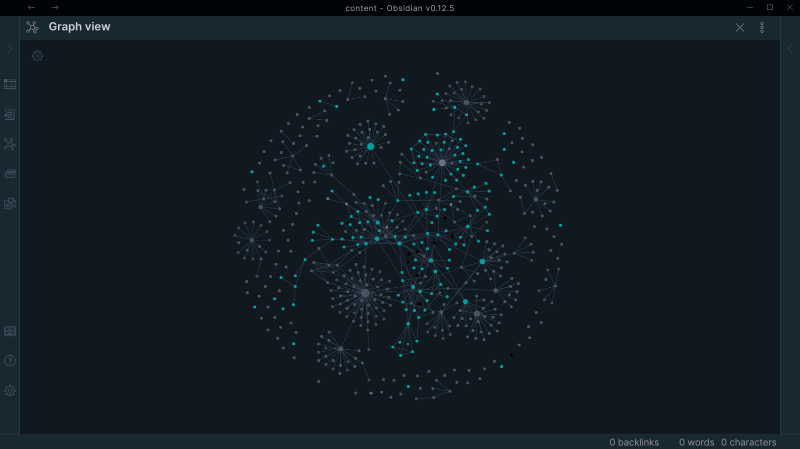

Obsidian-darkyan
===

> Obsidian theme



## Installation

```bash
cp obsidian.css <VAULT_DIRECTORY>/themes/Darkyan.css
```

## License

This project is licensed under the GNU GPL v3.0 - see the [LICENSE.txt](LICENSE.txt) file for details

**Free Software, Hell Yeah!**
