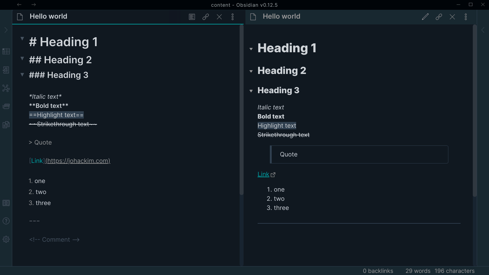

Obsidian-darkyan
===

> Obsidian theme




## Installation

```bash
cp obsidian.css <VAULT_DIRECTORY>/.obsidian/themes/Darkyan.css
```

## Support me


Please support me with a one-time or a monthly donation and help me continue my activities.

[](https://github.com/sponsors/johackim/)
## License

This project is licensed under the GNU GPL v3.0 - see the [LICENSE.txt](LICENSE.txt) file for details

**Free Software, Hell Yeah!**
